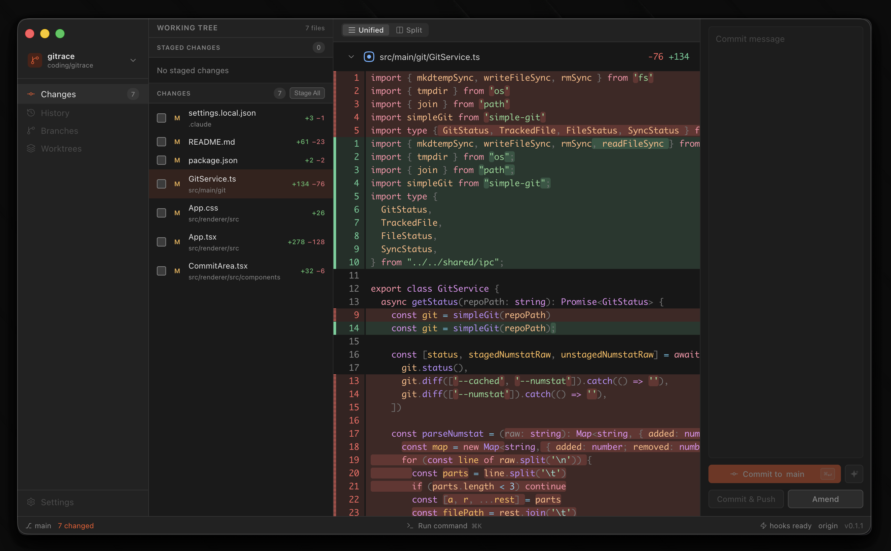
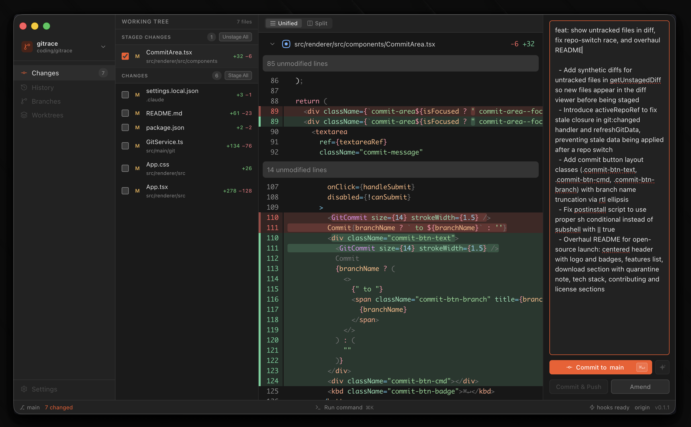

<div align="center">
  
  <h1>Gitrace</h1>

  <p><strong>Pre-commit diff review and commit flow for macOS.</strong></p>

  <p>
    
    
    
  </p>
</div>

---

Gitrace is a keyboard-driven macOS desktop app for reviewing git diffs and committing with confidence. See staged and unstaged changes in a unified diff viewer, run pre-commit hooks inline, and commit — without ever leaving your workflow.

Built with Electron, React 19, and TypeScript.

## Screenshots

<table>
  <tr>
    <td align="center"><br/><sub>Unified diff viewer with staged and unstaged files</sub></td>
    <td align="center"><br/><sub>Commit message panel with pre-commit hook output</sub></td>
  </tr>
</table>

## Features

- **Multi-repo navigation** — switch between repositories from the sidebar
- **Staged / unstaged file tree** — stage or unstage files with `Space`
- **Unified diff viewer** — syntax-highlighted diff for the selected file
- **Pre-commit hook output** — hook results shown inline before you commit
- **Amend commits** — rewrite the last commit without leaving the app
- **Command palette** — quick-access actions via `Cmd+K`
- **Keyboard-driven** — navigate entirely without a mouse
- **Custom keybindings** — edit `~/.gitrace/keybindings.json`, picked up live

## Download

Download the latest `.dmg` from the [Releases](https://github.com/cassiorsfreitas/gitrace/releases/latest) page.

> **macOS quarantine warning:** If macOS blocks the app on first launch, run:
>
> ```bash
> xattr -dr com.apple.quarantine /Applications/Gitrace.app
> ```

## Build from source

**Prerequisites**

- macOS
- Node.js v22+
- Git

**Run**

```bash
git clone https://github.com/cassiorsfreitas/gitrace.git
cd gitrace
npm install
npm run dev
```

**Tests**

```bash
npm test
```

**Release build**

Bump the version, tag, and push — CI builds and publishes the `.dmg` automatically:

```bash
npm version patch   # or minor / major
git push && git push --tags
```

## UI Layout

The app has a four-column layout:

| Column | Name          | Description                                               |
| ------ | ------------- | --------------------------------------------------------- |
| 1      | NavRail       | Switch between repositories                               |
| 2      | FileTreePanel | Staged/unstaged files — stage or unstage with `Space`     |
| 3      | DiffCanvas    | Unified diff viewer for the selected file                 |
| 4      | CommitArea    | Commit message, pre-commit hook output, and commit button |

## Keybindings

Keybindings are stored at `~/.gitrace/keybindings.json` and created automatically on first run. Edit the file directly — changes are picked up without restarting.

| Action           | Key         |
| ---------------- | ----------- |
| Next line        | `j`         |
| Prev line        | `k`         |
| Next file        | `Ctrl+J`    |
| Prev file        | `Ctrl+K`    |
| Toggle stage     | `Space`     |
| Commit           | `Cmd+Enter` |
| Focus left       | `Ctrl+H`    |
| Focus right      | `Ctrl+L`    |
| Open in editor   | `o`         |
| Command palette  | `Cmd+K`     |
| Edit keybindings | `Cmd+,`     |

## Tech stack

Electron 42, React 19, TypeScript, Vite, electron-vite, simple-git, Vitest.

## Contributing

Issues and PRs are welcome. Feel free to open issues, suggest features, or submit pull requests.

## License

[MIT](LICENSE)
